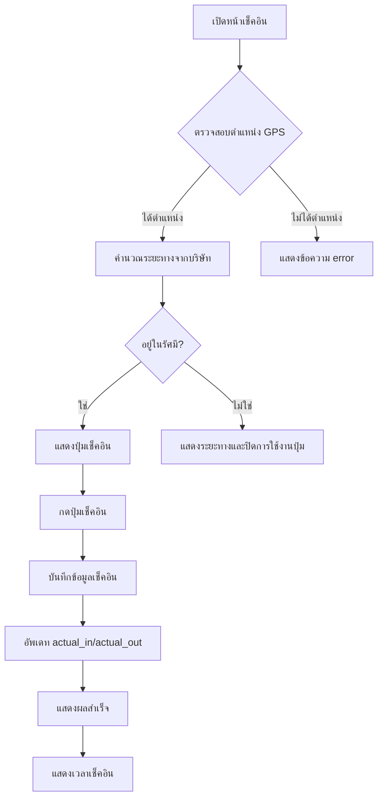
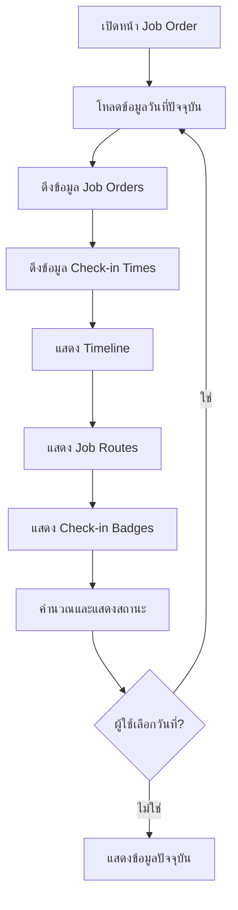
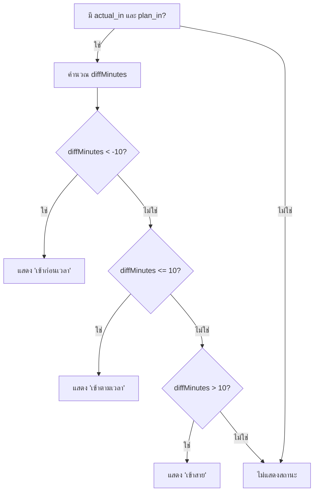

# คู่มือการใช้งาน TMS Mobile Application

## สารบัญ
1. [หน้าหลัก (Home Screen)](#หน้าหลัก-home-screen)
2. [หน้าเช็คอิน (Check-in Screen)](#หน้าเช็คอิน-check-in-screen)
3. [หน้า Job Order](#หน้า-job-order)
4. [Flow การทำงาน](#flow-การทำงาน)

---

## หน้าหลัก (Home Screen)

### ภาพหน้าจอ
- `Screenshot 2025-12-25 134759.png`
- `Screenshot 2025-12-25 134826.png`

### ฟีเจอร์หลัก
- แสดงเมนูหลักของแอปพลิเคชัน
- การนำทางไปยังหน้าต่างๆ

---

## หน้าเช็คอิน (Check-in Screen)

### ภาพหน้าจอ
- `Screenshot 2025-12-25 140132.png`
- `Screenshot 2025-12-25 140147.png`
- `Screenshot 2025-12-25 140215.png`
- `Screenshot 2025-12-25 140241.png`
- `Screenshot 2025-12-25 140323.png`
- `Screenshot 2025-12-25 140413.png`

### ขั้นตอนการใช้งาน

#### 1. การเช็คอินเข้างาน
1. เปิดหน้าเช็คอิน
2. ระบบจะแสดงแผนที่พร้อมตำแหน่งบริษัท
3. ตรวจสอบว่าอยู่ในรัศมีที่กำหนด (แสดงระยะทาง)
4. กดปุ่ม "เช็คอิน"
5. ระบบจะบันทึกเวลาเช็คอินและแสดงผล

#### 2. การเช็คเอาท์
1. หลังจากเช็คอินแล้ว
2. กดปุ่ม "เช็คเอาท์"
3. ระบบจะบันทึกเวลาเช็คเอาท์

#### 3. การแสดงผลเวลาเช็คอิน/เช็คเอาท์
- แสดงเวลาเช็คอินและเวลาเช็คเอาท์ **เฉพาะวันที่ปัจจุบันเท่านั้น**
- ถ้าวันนั้นไม่มีข้อมูล จะไม่แสดงอะไร

---

## หน้า Job Order

### ภาพหน้าจอ
- `Screenshot 2025-12-25 142211.png`
- `Screenshot 2025-12-25 142239.png`
- `Screenshot 2025-12-25 142300.png`
- `Screenshot 2025-12-25 142317.png`

### ขั้นตอนการใช้งาน

#### 1. การดู Job Orders
1. เปิดหน้า Job Order
2. ระบบจะแสดง Job Orders ของวันที่ปัจจุบัน
3. สามารถเลือกวันที่อื่นได้จากปฏิทิน
4. เมื่อเลือกวันที่ ระบบจะโหลดข้อมูลใหม่ตามวันที่ที่เลือก

#### 2. Timeline View
- แสดง Timeline แบบ 24 ชั่วโมง (00:00 - 23:00)
- แต่ละชั่วโมงมีวงกลมเป็น marker
- Job routes จะแสดงเป็นการ์ดบน timeline
- เส้นสีแดงแสดงเวลาปัจจุบัน

#### 3. การแสดงสถานะ
- **สถานะเข้างาน:**
  - เข้าก่อนเวลา (สีส้ม) - ถ้า `actual_in` ก่อน `plan_in` มากกว่า 10 นาที
  - เข้าตามเวลา (สีเขียว) - ถ้า `actual_in` = `plan_in` ± 10 นาที
  - เข้าสาย (สีแดง) - ถ้า `actual_in` หลัง `plan_in` มากกว่า 10 นาที

- **สถานะออกงาน:**
  - ออกก่อนเวลา (สีส้ม) - ถ้า `actual_out` ก่อน `plan_out` มากกว่า 10 นาที
  - ออกตามเวลา (สีเขียว) - ถ้า `actual_out` = `plan_out` ± 10 นาที
  - ออกก่อนเวลา (สีส้ม) - ถ้า `actual_out` หลัง `plan_out` มากกว่า 10 นาที

#### 4. การแสดง Check-in Times
- แสดงเวลาเช็คอินจาก `tb_check_in_job` บน timeline
- แสดงเป็น badge สีแดงพร้อมข้อความ "เช็คอิน" และเวลา
- อยู่ใกล้เส้น timeline แนวตั้งทางซ้าย

#### 5. การแสดง Actual Times
- แสดง `actual_in`, `actual_out`, `actual_in2`, `actual_out2` (ถ้ามี)
- แสดงเป็นข้อความสีเขียวพร้อมไอคอน check circle

---

## Flow การทำงาน

### Flow การเช็คอินเข้างาน

### Flow การดู Job Orders

### Flow การคำนวณสถานะ

---

## หมายเหตุ

- เวลาทั้งหมดแสดงในรูปแบบ UTC+7 (Thailand time)
- การคำนวณสถานะทำที่ Backend API
- Timeline จะเลื่อนอัตโนมัติไปที่เส้นเวลาปัจจุบัน
- ข้อมูลจะ refresh อัตโนมัติหลังจากเช็คอิน

---

## การแก้ไขปัญหา

### ปัญหา: ไม่แสดงข้อมูลเช็คอิน
- ตรวจสอบว่าเช็คอินในวันที่ปัจจุบันหรือไม่
- ตรวจสอบการเชื่อมต่ออินเทอร์เน็ต

### ปัญหา: สถานะไม่แสดง
- ตรวจสอบว่ามี `actual_in`/`actual_out` และ `plan_in`/`plan_out` หรือไม่
- ตรวจสอบว่าเวลาต่างกันเกิน ±10 นาทีหรือไม่

---

*เอกสารนี้สร้างจาก Screenshot วันที่ 25 ธันวาคม 2025*

